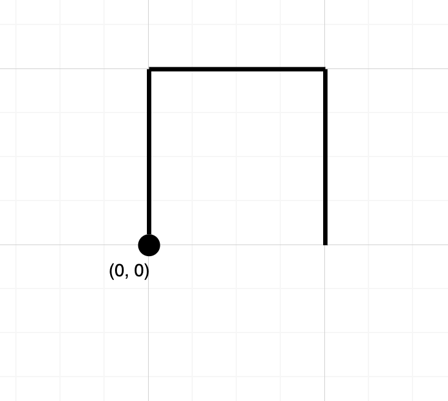
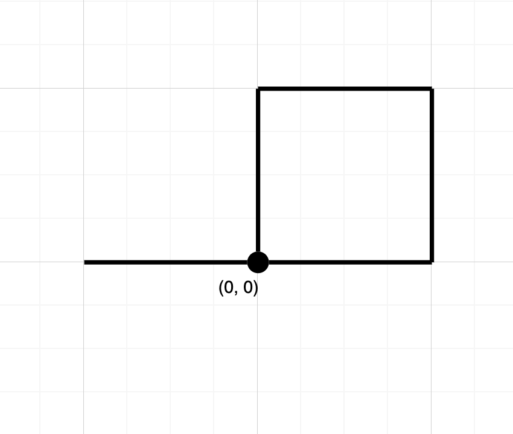

# Crossing Paths Coding Question

## Prompt:
Oh No! Our airplane has developed engine troubles! The plane will continue to fly
but is leaving a toxic chemical trail. If we fly through the chemical exhaust, our
engines will fail completely. Additionally, we cannot change elevation.

Lucky for us, Alaska has dispatched a rescue plane. We must calculate if the
flightPlan to the rescue plane suggested by an Air Traffic Controller for our plane
is safe.

We represent a flightPlan as a string that contains = 'N', 'S', 'E' or 'W', each
representing moving one unit north, south, east, or west, respectively. We start at
the origin (0, 0) on a 2d grid and fly on the path specified by flightPlan.
Return True if the flightPlan crosses itself at any point, that is, if at any time we will
fly on a position previously visited. Return False otherwise.

## Example 1:
- Input: "NES"
- Output: false

Explanation: Notice that the flightPlan doesn't cross any point more than once.

## Example 2:
- Input: "NESWW"
- Output: true

Explanation: Notice that the flighPlan visits the origin twice.

## Getting Started
Open the CrossingPathsJavascript source in your editor of choice. Run npm i. 

The entrypoint for your implementation will be in src/flightPathHandler.js, in there you'll find the FlightPathHandler class with the `IsFlightPlanCrossing` function. Your job will be to make this method return the correct response based on the criteria above.

Your implmentation does not need to be completely contianed within this class.

## Tests
There is a suite of tests in the test/flightPathHander.tests.js. All these tests must pass for the implementation to be considered correct.

## Bonus
Write additional tests for cases not covered by the existing tests.